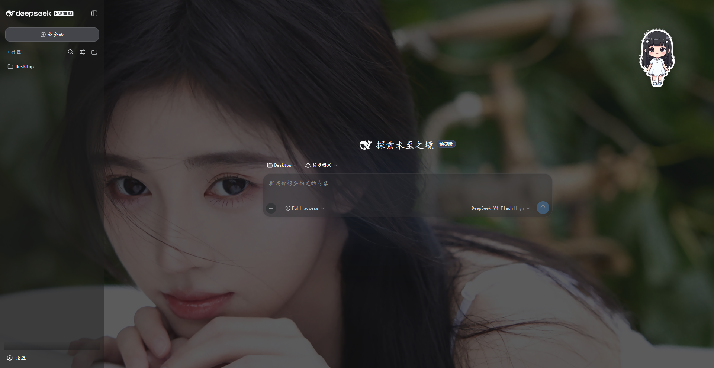

# Custom DeepSeek Harness

把 DSH（DeepSeek Harness）的 Web 界面定制成 **背景图 + 楷体 + 深蓝主色 + 半透明磨砂 + Q 版桌宠**，并内置一个原生的「背景设置」标签，可在界面上实时调节背景、透明度、字体、字号与桌宠；同时提供**任务完成提醒**——任务跑完且你没在看页面时，桌宠会弹出提醒「主人，你的任务完成了哦」；侧边栏底部还内置一张 **DeepSeek API 余额卡片**，实时显示余额并提供「API 平台 / 在线对话」快捷入口。

核心实现是一个符合 DSH「一切皆插件」规范的插件包 `dsh-plugin-user-theme`。

## 成果

| 模块 | 说明 |
|------|------|
| **插件** | `dsh-plugin-user-theme/`，双端架构（Node 注入 CSS / 余额代理 + Client 注册设置标签、桌宠与余额卡片） |
| **桌宠** | 右上角 Q 版 chibi 小人：呼吸浮动 + 随机眨眼，悬停挥手，点击 wink/跳跃，可拖拽换位；设置面板可开关、调大小、复位位置 |
| **任务完成提醒** | 任务耗时 ≥ 阈值（默认 30s）且没在看页面时，三级提醒：页签气泡 + 提示音、Windows 系统通知、独立 Python 桌面宠物（真正 OS 级置顶窗口） |
| **DeepSeek 余额卡片** | 侧边栏底部磨砂卡片显示实时余额（绿/橙/红状态点、骨架屏、自动/手动刷新），卡片右侧内置「API 平台 / 在线对话」两个填充按钮；API Key 只在 Node 端解析，浏览器不接触；预览见 `demo/balance-card-preview.html` |
| **预览地址** | http://127.0.0.1:3080/ |

## 效果图



## 插件结构

```
dsh-plugin-user-theme/
├── package.json            # 元数据 + dsh.bundle + dsh.client.web 声明
├── cordis.patch.yml        # 挂载入口（insert user-theme）
├── src/index.js            # Node 端：注入 CSS + 壁纸/桌宠帧 base64；agent/status 耗时检测 + SSE 路由 + Python 桌宠托管 + /balance 余额查询代理
├── lib/client.js           # Client 端：settings.section slot 注册「背景设置」+ 桌宠 + 任务完成提醒 + sidebar.footer.action 余额卡片
├── desktop_pet.py          # 独立桌面宠物：tkinter 置顶透明窗，SSE 订阅完成事件，跳跃+气泡+提示音
├── assets/bg.jpg           # 默认背景图
├── assets/pet/             # 桌宠动作帧（idle/blink/wave/wink/jump，透明 PNG）
├── README.md
└── LICENSE
```

## 工作原理

1. **Node 端**（`src/index.js`）：`apply(ctx)` 注入 `webServer` 服务，`webServer.tapIndex()` 向所有 HTML 响应注入 `<style>`（默认主题：背景图、楷体、深蓝主色、各层透明度）以及 `window.__USER_THEME_ASSETS__`（壁纸 base64）
2. **Client 端**（`lib/client.js`）：通过官方 `settings.section` slot 把「背景设置」注册为设置面板第 5 个原生标签；React 组件负责交互，用 `setProperty(prop, value, "important")` 覆盖 CSS 变量实现实时预览，并持久化到 `localStorage`

设置标签走 DSH 官方 client 插件机制，由 React 原生渲染切换，**不做 DOM hack**，因此不会卡死或内容叠加。

## 本地挂载（开发）

1. junction 链接（零拷贝）：

   ```powershell
   mklink /J "C:\Users\ZhuanZ\.dsh\profiles\node_modules\dsh-plugin-user-theme" "<本仓库>/dsh-plugin-user-theme"
   ```

2. 编辑 `C:\Users\ZhuanZ\.dsh\profiles\web\cordis.patch.yml`，追加：

   ```yaml
   - insert:
       - id: user-theme
         name: dsh-plugin-user-theme
   ```

3. 重启 DSH 后强刷浏览器

## 使用

打开 DSH 设置面板 → 点左侧「背景设置」标签：

- **背景图**：默认壁纸 / 上传自定义图片（≤ 2MB）
- **UI 透明度**：主区域 / 侧边栏 / 输入框 / 设置面板 四档独立调节
- **字体**：楷体 / 系统默认，字号 13–20px
- **桌宠**：显示开关、大小滑块（60–160px）、复位位置
- **任务完成提醒**：总开关、最短提醒耗时（5–300s）、提示音、系统通知（需授权）、桌面宠物，以及「测试提醒效果」按钮
- **重置默认**：一键恢复

## 侧边栏余额卡片

插件 v0.2.0 起，侧边栏底部（设置按钮上方）多一张 DeepSeek 余额卡片：

- 左栏显示余额与更新时间，右栏是「API 平台」（→ platform.deepseek.com/usage）与「在线对话」（→ chat.deepseek.com）两个上下堆叠的填充按钮，位于刷新按钮正下方
- 余额由 Node 端代理查询官方 `GET /user/balance`：API Key 经 DSH 的 credentials 服务在服务端解析（与聊天同一凭据通道），浏览器只请求本机插件路由、拿不到 Key；结果缓存 60s
- 5 分钟自动刷新 / 切回标签页刷新 / 手动刷新；余额低于 ¥5 变橙点，异常或未配置 Key 变红点；侧边栏折叠时收成状态圆点

详细说明（含安全模型、可选配置）见 [`dsh-plugin-user-theme/README.md`](dsh-plugin-user-theme/README.md#deepseek-api-余额卡片)。

## 其他目录

- `demo/`：静态 HTML 高保真预览。`index.html` 为早期主题 demo；`balance-card-preview.html` 为余额卡片各状态预览（直接用浏览器打开）
- `backup_20260815_123700/`：最初改动前的配置文件备份

## License

MIT
